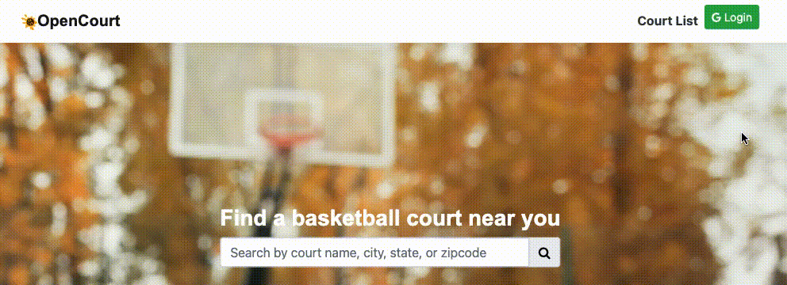
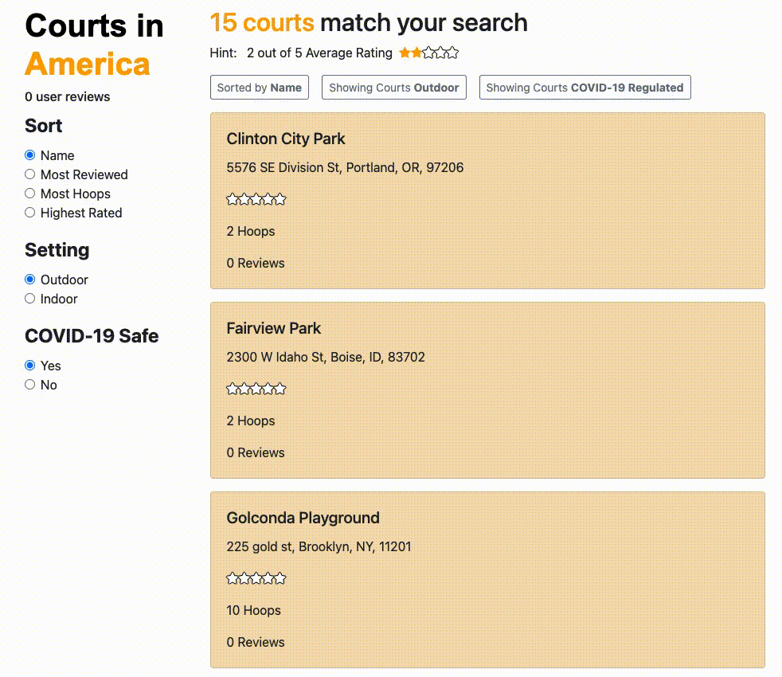

# 
 **Open Court**   

### 
 Find a basketball court near you! 

### _Contributor(s) and Contact Info_ 
> Tien Nguyen [GitHub](https://github.com/Tien96ng)

---

## _Technologies Used_ ⚙

* **Bootstrap / ReactStrap**
* **C# / .NET**
* **Cross ENV**
* **CSS3**
* **Draw.io**
* **ESLint**
* **Entity MVC Framework**
* **FontAwesome**
* **JSX**
* **JavaScript**
* **MySQL**
* **Pomelo**
* **React**
* **React Context**
* **React Google**
* **React Router**

---

## _Description_ 📃
My favorite hobby that helped me expand my social and team building skills in life has been basketball. But since COVID-19 occurred, the majority of gyms and outdoor basketball courts have been closed. As the epidemic is coming to a steady end (hopefully), gyms and courts start opening up.

With that being said, this web app can be a centralized place to find open courts or just basketball courts in general.

---

## _Planning via Component Diagram_ 💭

Open to view the Diagram

### **Mock Landing Page Design via [Draw.io](https://app.diagrams.net/)**

### **Toast Notification for Logins and Guest(s)**

### **Court Sort Functionality**

### **Search by Location Functionality**

---

## _Installation Guide_ 💻 

Open for full Guide

### _Cloning and Initial Setup_

> Repository: https://github.com/Tien96ng/open-court

### _Client Side Setup_

### _Server Side Setup_

---

## _Known Bugs_ 🩹
* None at the moment (5/20/2021)

---

## _Current Features_ 🏀 
* Users should be able to log in via their Google email.
* Ability to search for Basketball courts on location (Street, City, State, or ZipCode).
* Login verification for full access.
* Sort-ability by Name, Number of hoops, reviews, or ratings.
* Filter by indoor or door type of basketball court.
* Filter by COVID-19 safe or closed.
* Add a new court by API POST.
* Full CRUD in backend .NET API for Courts (“api/courts”).

---

## _Future Updates_ 🛠
* User profile page.
* Favorites page for each user.
* Details page render for each court for more specific information.
* Reviews to show in details page.
* Google Maps API to drop a pin and render a Map for the location of each court.
* Users can post a review of any court.
* Users can favorite a court and save it to their profile.
* Move from ReactStrap to Material UI headless components
* JWT Authentication for backend .NET API.
* Full CRUD in backend for Reviews.
* Full CRUD in backend for Users (Admin use).
* More login options besides Google.
* Deploy and host the web app.

---

## _License_ ⚖️

Copyright (c) 2021 Tien Nguyen.

Please contact Contributor for further use information or if you would like to make a contribution.
