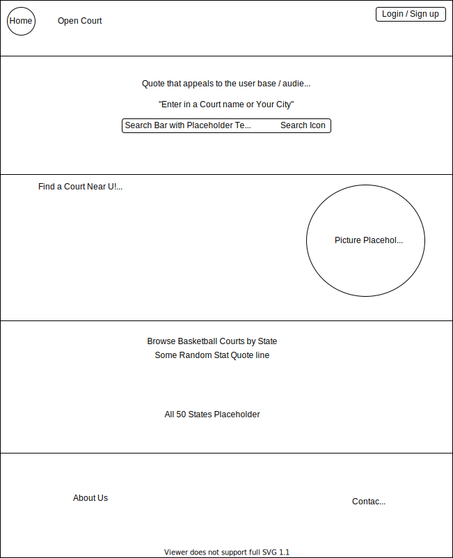

# 
 **Open Court**   

### 
 Find a basketball court near you! 

### _Contributor(s) and Contact Info_ 
> Tien Nguyen [GitHub](https://github.com/Tien96ng)

---

## _Technologies Used_ ⚙

* **C# / .NET**
* **Entity MVC**
* **MySQL**
* **JavaScript**
* **JSX**
* **ReactJs**
* **React Context**
* **JEST**
* **React Bootstrap**
* **NPM**
* **ESLint**
* **Babel**
* **Draw.io**

---

## _Description_ 📃
A centralized destination to view local to nationwide indoor and outdoor basketball courts ratings (RateMyProfessor but for Basketball Courts).

---

## _Planning via Component Diagram_ 💭

Open to view the Diagram

### **Mock Landing Page Design via [Draw.io](https://app.diagrams.net/)**

---

## _Installation Guide_ 💻 

Open for full Guide

### _Cloning and Initial Setup_

> Repository: https://github.com/Tien96ng/open-court

### _Client Side Setup_

### _Server Side Setup_

---

---

## _Known Bugs_ 🩹
* None at the moment (4/23/2021)

---

## _Future Updates_ 🛠
* 

---

## _License_ ⚖️

Copyright (c) 2021 Tien Nguyen.

Please contact Contributor for further use information or if you would like to make a contribution.
